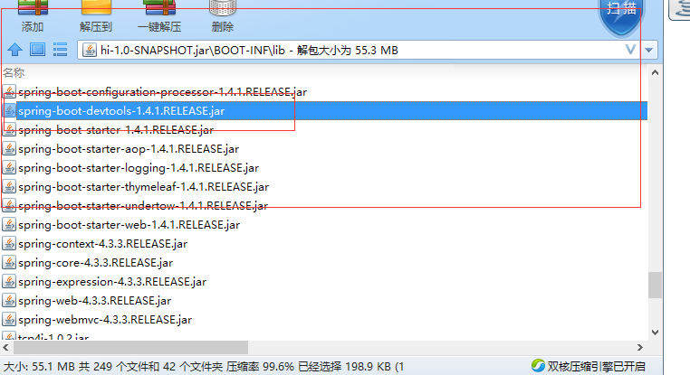

Maven的Dependency scope是用来限制Dependency的作用范围的, 影响maven项目在各个生命周期时导入的package的状态。总共有6种范围，默认是`compile`，作用于整个生命周期。当scope设置为`provided`时，打包的时候可以不用包进去。该依赖理论上可以参与编译，测试，运行等周期，相当于compile，但是在打包阶段做了exclude的动作。

例如，Java EE中Servlet api，我们在编译的时候用到servlet-api和jsp-api，但在打包的时候不用这两个依赖，因为容器都有提供。

```xml
<dependency>  
	<groupId>javax.servlet</groupId>  
	<artifactId>servlet-api</artifactId>  
	<version>2.5</version>  
	<scope>provided</scope>  
</dependency>
<dependency>  
	<groupId>javax.servlet.jsp</groupId>  
	<artifactId>jsp-api</artifactId>  
	<version>2.1</version>  
	<scope>provided</scope>  
</dependency>
```
但是在spring boot当中，当Dependency scope设置为`provided`时，例如：

```xml
<dependency>
	<groupId>org.springframework.boot</groupId>
	<artifactId>spring-boot-devtools</artifactId>
	<optional>true</optional>
	<scope>provided</scope>
</dependency>
```
<!-- more --> 
`spring-boot-devtools`这个依赖帮助我们在开发的时候使用LiveReload或者Hot swapping，但是正式环境中用不到它（也有用但是我用不着），所以就没必要将这个依赖打入jar中，我将其设置为`<scope>provided</scope>`，但是生成executable jar中依旧含有这个jar包。



我们使用Spring Boot时，都会使用`Spring Boot Maven Plugin`插件，其中的一个作用通过`spring-boot:repackage`生成一个可执行的jar或者war。一个可执行的jar当中必然包含servlet容器，如默认的tomcat，所以`repackage`设计成：即使dependencies的scope为`provided`，依旧会将依赖打入jar当中。

为了可以excluded dependencies from the executable jar，所以`Spring Boot Maven Plugin`可以通过配置去排除依赖[exclude dependency](http://docs.spring.io/spring-boot/docs/current/maven-plugin/examples/exclude-dependency.html "exclude dependency")

- 通过特定的`groupId`和`artifactId`来排除 (有的依赖还有`classifier`)
- 通过指定`artifactId`来排除：任何符合给定的`artifactId`都被排除
- 通过指定`groupId`来排除属于这个`groupId`下的依赖


排除特定依赖`com.foo:bar`：
```xml
<project>
  ...
  <build>
    ...
    <plugins>
      ...
      <plugin>
        <groupId>org.springframework.boot</groupId>
        <artifactId>spring-boot-maven-plugin</artifactId>
        <version>1.4.2.RELEASE</version>
        <configuration>
          <excludes>
            <exclude>
              <groupId>com.foo</groupId>
              <artifactId>bar</artifactId>
            </exclude>
          </excludes>
        </configuration>
        ...
      </plugin>
      ...
    </plugins>
    ...
  </build>
  ...
</project>
```

排除artifact为`my-lib` 或者 `another-lib`的依赖
```xml
<project>
  ...
  <build>
    ...
    <plugins>
      ...
      <plugin>
        <groupId>org.springframework.boot</groupId>
        <artifactId>spring-boot-maven-plugin</artifactId>
        <version>1.4.2.RELEASE</version>
        <configuration>
          <excludeArtifactIds>my-lib,another-lib</excludeArtifactIds>
        </configuration>
        ...
      </plugin>
      ...
    </plugins>
    ...
  </build>
  ...
</project>
```

排除所有属于`com.foo`这个group的依赖
```xml
<project>
  ...
  <build>
    ...
    <plugins>
      ...
      <plugin>
        <groupId>org.springframework.boot</groupId>
        <artifactId>spring-boot-maven-plugin</artifactId>
        <version>1.4.2.RELEASE</version>
        <configuration>
          <excludeGroupIds>com.foo</excludeGroupIds>
        </configuration>
        ...
      </plugin>
      ...
    </plugins>
    ...
  </build>
  ...
</project>
```