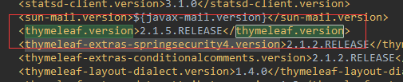

如果你的spring boot应用继承`spring-boot-starter-parent`，那么只需要添加`spring-boot-starter-thymeleaf`这个starter依赖，即可使用thymeleaf模板引擎
     
	<dependency>
            <groupId>org.springframework.boot</groupId>
            <artifactId>spring-boot-starter-thymeleaf</artifactId>
	</dependency>

<!-- more --> 
## 升级为thymeleaf 3
从`spring-boot-dependencies`中的`dependencyManagement`中可以看到：`spring-boot-starter-thymeleaf`，默认使用Thymeleaf 2.1

如果要改为Thymeleaf 3，只需要重写`thymeleaf.version`和`thymeleaf-layout-dialect.version`两个properties

	<properties>
	    <thymeleaf.version>3.0.2.RELEASE</thymeleaf.version>
	    <thymeleaf-layout-dialect.version>2.1.1</thymeleaf-layout-dialect.version>
	</properties>

## thymeleaf 3
Thymeleaf3完全兼容Thymeleaf2，升级到Thymeleaf3的过程中，我只用到的部分特性，参考地址：[Thymeleaf 3 迁移指南](http://www.thymeleaf.org/doc/articles/thymeleaf3migration.html "Thymeleaf 3 迁移指南")。

### 1.Full HTML5 markup support（完整的HTML5 标记支持）
Thymeleaf 2.1中，html代码必须严格遵守XML规范，必须是**XML-well-formed HTML5 code**，比如：
1. 标签必须闭合，` ` 是错误的
2. 属性必须有值，`` 是不被允许的

不是所有的人都会完全的遵守XML规范，Thymeleaf2中要解决这个问题，可以将`spring.thymeleaf.mode`这个属性改为`LEGACYHTML5`，然后添加`nekoHTML`这个库。如果使用Thymeleaf3，就不会存在这个问题，因为Thymeleaf3使用新的解析引擎。

### 2.Template modes（模板类型）

- HTML、XML、TEXT、JAVASCRIPT、CSS、RAW

分为三类：标记型模板（HTML，XML）,文本型模板(TEXT, JAVASCRIPT和CSS)，无操作(no-op)模板 (RAW)。

- Thymeleaf2.1中的`HTML5`, `XHTML`, `VALIDXHTML`和`LEGACYHTML5`相当于3.0中的 `HTML`
- Thymeleaf2.1中的`VALIDXML`也就是3.0中的`XML`

所以在Thymeleaf3中使用`HTML`包括了HTML5，HTML4和XHTML在内的所有类型的HTML标记，此时，标记的作用范围按可能的最大化处理。

spring boot需要将默认的`HTML5`改为`HTML`，在application.properties文件中增加：`spring.thymeleaf.mode=HTML`

##### Improved inlining mechanism（增强的内联机制）
Thymeleaf3中可无需额外的标签，直接在文本中输出数据
	
	
This product is called [[${product.name}]] and it's great!

	
Thymeleaf2.1中则需要使用内联标签`th:inline`

	

	   This product is called [[${product.name}]] and it's great!
	

上面的代码中也可以使用`[(${product.name)]`来代替，`[[...]]`和`[(...)]`区别在于`[(...)]`中的文本不会被Escape，就相当于`th:text`和`th:utext`的区别

### 3.Fragment Expressions（片段表达式）

Thymeleaf 3.0 引入了一个新的Fragment Expressions。像是这样：` ~{commons::footer}`。例如，我们定义一个模版页面base.html

	<head th:fragment="common_header(title,links)">
	
	  <title th:utext="${title}">The awesome application</title>
	
	  <!-- Common styles and scripts -->
	  <link rel="stylesheet" type="text/css" media="all" th:href="@{/css/awesomeapp.css}">
	  <link rel="shortcut icon" th:href="@{/images/favicon.ico}">
	  
	
	  <!--/* Per-page placeholder for additional links */-->
	  <th:block th:replace="${links} ?: ~{}" />
	
	</head>
在我们页面中使用这个模板

	...
	<head th:replace="base :: common_header(~{::title},~{::link})">
	
	  <title>Awesome - Main</title>
	
	  <link rel="stylesheet" th:href="@{/css/bootstrap.min.css}">
	  <link rel="stylesheet" th:href="@{/themes/smoothness/jquery-ui.css}">
	
	</head>
	...

结果会输出：

	...
	<head>
	
	  <title>Awesome - Main</title>
	
	  <!-- Common styles and scripts -->
	  <link rel="stylesheet" type="text/css" media="all" href="/awe/css/awesomeapp.css">
	  <link rel="shortcut icon" href="/awe/images/favicon.ico">
	  
	
	  <link rel="stylesheet" href="/awe/css/bootstrap.min.css">
	  <link rel="stylesheet" href="/awe/themes/smoothness/jquery-ui.css">
	
	</head>
	...

这个特性解决了通用的header和footer的问题，详细说明参考：[https://github.com/thymeleaf/thymeleaf/issues/451](https://github.com/thymeleaf/thymeleaf/issues/451 "Fragment Expressions")

### 4.Decoupled Template Logic（模板逻辑解耦）

定义一个完全的html模版`home.html`
	
	<!DOCTYPE html>
	<html>
	  <body>
	    <table id="usersTable">
	      <tr>
	        <td class="username">Jeremy Grapefruit</td>
	        <td class="usertype">Normal User</td>
	      </tr>
	      <tr>
	        <td class="username">Alice Watermelon</td>
	        <td class="usertype">Administrator</td>
	      </tr>
	    </table>
	  </body>
	</html>

然后只需要定义一个`home.th.xml`

	<?xml version="1.0"?>
	<thlogic>
	  <attr sel="#usersTable" th:remove="all-but-first">
	    <attr sel="/tr[0]" th:each="user : ${users}">
	      <attr sel="td.username" th:text="${user.name}" />
	      <attr sel="td.usertype" th:text="#{|user.type.${user.type}|}" />
	    </attr>
	  </attr>
	</thlogic>

这样前端人员写的html与后端代码完全解耦，详细说明参考：[https://github.com/thymeleaf/thymeleaf/issues/465](https://github.com/thymeleaf/thymeleaf/issues/465 "Decoupled template logic")