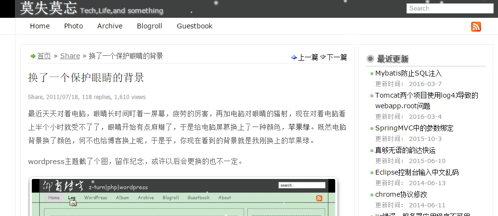

# Wordpress #

2010年夏天开始学习并使用Wordpress写博客，已经有好几年了，当时还是在学校里面，学的是与计算机无关的专业。一开始接触的程序是学校的Discuz论坛，那时就对网站有关的知识产生了极大了兴趣，通过网络认识了Wordpress这个程序，然后开始慢慢的折腾，对网站的一些概念才有了一定的认识，所以才有了后来转到计算机专业的念头。

<!-- more --> 
当然由于一些原因，除了最开始的几年我会经常的去折腾主题，折腾特效，觉得蛮有意思外，后面几乎没有花时间在上面了。wordpress是php写，我使用的是最便宜的虚拟主机，运行的环镜：`Apache+php+Mysql`。一年的费用是100元。

# Hexo #

前几天开始尝试使用hexo与markdown做一个静态博客，Hexo 是一个快速、简洁且高效的博客框架。Hexo 使用 Markdown（或其他渲染引擎）解析文章，在几秒内，即可利用靓丽的主题生成静态网页。

并将博客托管到github pages上.

markdown还是挺有用的，最近也在研究使用gitbook写交流文档。

[http://book.imyxiao.com](http://book.imyxiao.com)

