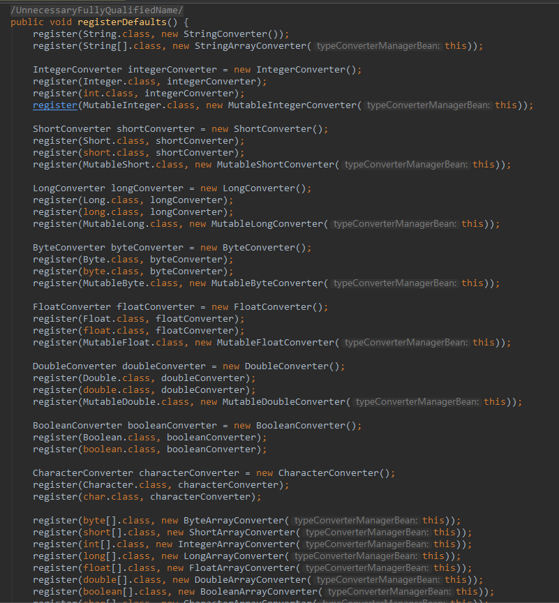
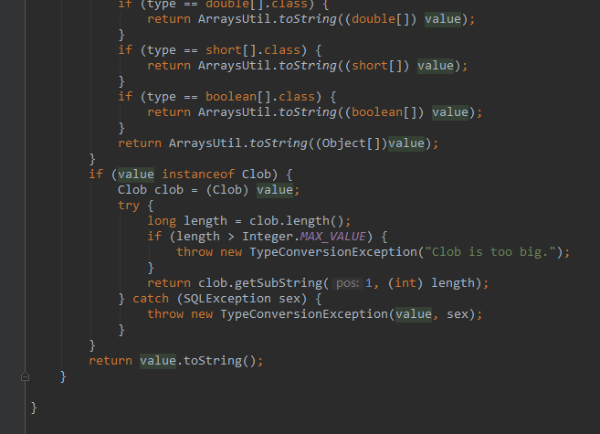
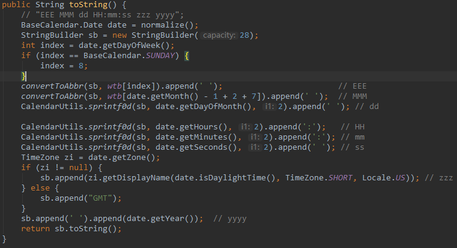
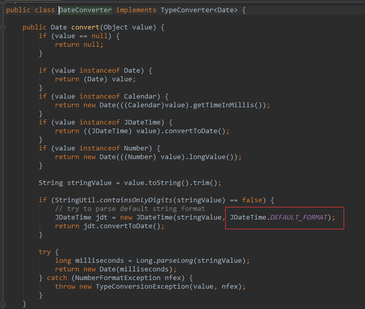

公司的项目是微服务架构，使用facebook的thrift框架作为微服务之间rpc通信的协议，thrift是一个跨语言的服务框架。
> Thrift通过接口定义语言 (interface definition language，IDL) 来定义数据类型和服务，Thrift接口定义文件由Thrift代码编译器生成thrift目标语言的代码。

Thrift编译器生成API文件，我们分别实现其server与client。在server端，将服务需要响应的数据（如数据库中查询所得）封装到thrift生成的java对象中序列化后返回，在client端收到之后，反序列化成thrift生成的java对象。thrift框架的序列化及反序列化使用的binary protocol，即二进制协议，速度快，性能高。

<!-- more --> 

## BeanCopy 

我们在使用Thrift的过程中，需要使用到两次java对象属性的复制：server端再将对象复制到thrift生成的java对象中，client端将thrift对象复制到自己的定义的java对象中。java中使用bean copy的工具类，比较多是的jodd的beanCopy与Apache的BeanUtils，我们用的jodd。将A对象复制到B对象，jodd的BeanCopy使用如下：

    BeanCopy.beans(A, B).copy();

然而由于thrift框架的基本数据类型中，没有java中的时间类型，即`java.util.Date`，我们会将时间定义为String或long类型。比较推荐使用long类型时间戳，但是之前代码中都使用的String类型，比较令人讨厌，旧的项目中大量的使用BeanCopy，这时候改动比较麻烦。

那么使用String来表示时间，配置BeanCopy的Converter。

## Converter

jodd中类型之间的转换大量的使用Converter，并且有一个"类型转换管理器"：`jodd.typeconverter.TypeConverterManager`。`TypeConverterManager`注册了大量的转换器。


将Date转化为String,使用的是`jodd.typeconverter.impl.StringConverter`



原理很简单，先判断被转换对象的类型，然后实现不同对象的转换，Date转换为String使用的是Date的toString方法



被转化的String格式为：`"EEE MMM dd HH:mm:ss zzz yyyy"`，且Locale为US

jodd中的使用`jodd.typeconverter.impl.DateConverter`将对象转化为Date



使用的默认格式为：`YYYY-MM-DD hh:mm:ss.mss` ，这时候我们有两种解决方案。
- 在server端重新注册StringConverter，BeanCopy时就将Date转为`YYYY-MM-DD hh:mm:ss.mss`格式的String，client端会被转换为Date
- 在client端重新注册DateConverter，BeanCopy时将"EEE MMM dd HH:mm:ss zzz yyyy"格式的String转换为Date

DateConverter（项目启动后，执行即可）：
```java
TypeConverterManager.register(Date.class, value -> {
    if (value == null) {
        return null;
    } else if (value instanceof Date) {
        return value;
    } else if (value instanceof Number) {
        return new Date(((Number) value).longValue());
    } else {
        String stringValue = value.toString().trim();
        SimpleDateFormat slf = new SimpleDateFormat("EEE MMM dd HH:mm:ss zzz yyyy", Locale.US);
        try {
            return slf.parse(stringValue);
        } catch (ParseException e) {
            return null;
        }
    }
})
```
StringConverter类似，只需要增加一个Date类型的判断:
```java
if (value instanceof Date) {
	return new SimpleDateFormat("YYYY-MM-DD hh:mm:ss.mss").format(value);
}
```
## thrift的binary类型

公司有的项目直接使用thrift的binary做数据的返回类型，java中对应的是ByteBuffer。

这时候我们需要自己实现对象的序列化与反序列化，比如说MessagePack，一种比JSON更快、更小的格式

这时候就可以不用thrift生成的java对象了，也就不需要烦恼任何类型转换的问题了。